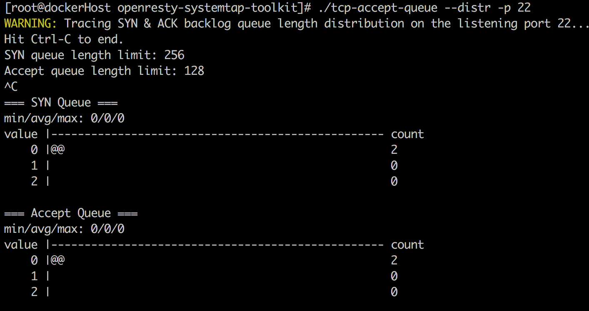

# systemtap-practice
systemtap practice

## INSTALL
* CentOS
  ```
  curl https://raw.githubusercontent.com/WALL-E/static/master/setup/redhat/install_systemtap|bash
  ```

## TEST
```
# test stap
stap -V

# test kernel-debuginfo
stap -L 'kernel.function("printk")'

# test glibc-debuginfo
stap -L 'process("/lib64/libc.so.6").function("malloc")'
```

## Community Resources and Tools

* http://sourceware.org/systemtap/
* https://github.com/openresty/openresty-systemtap-toolkit

  

* https://github.com/youzan/systemtap-toolkit

## Example

* basic
  * execsnoop-nd.stp
    * Trace process exec()s with arguments
    * [link](https://github.com/brendangregg/systemtap-lwtools/blob/master/execsnoop-nd.stp) 

* net
  * accept2close-nd.stp
    * Show socket duration: accept()->close()
    * [link](https://github.com/brendangregg/systemtap-lwtools/blob/master/net/accept2close-nd.stp) 
    
* proc
  * syscallbypid-nd.stp
    * Count syscalls with process details
    * [link](https://github.com/brendangregg/systemtap-lwtools/blob/master/proc/syscallbypid-nd.stp) 
